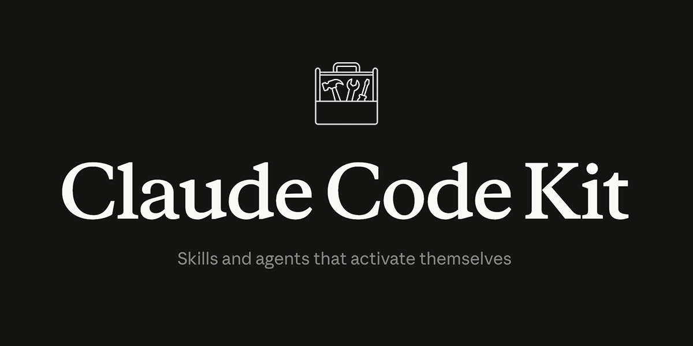

<p>
  
</p>

# Claude Code Kit

**A plugin marketplace for Claude Code with framework-specific skills and automatic detection.**

Get expert-level Claude Code assistance for your tech stack in seconds.

## Quick Start (Plugin Installation)

```bash
# In Claude Code, add the marketplace and run setup:
/plugin marketplace add blencorp/claude-code-kit
/setup
```

**That's it.** `/setup` detects your frameworks and installs the appropriate plugins automatically.

**Example:**
```
## Detected Frameworks

✓ Next.js (found "next" in package.json)
✓ React (found "react" in package.json)
✓ Prisma (found prisma/schema.prisma)
✓ TailwindCSS (found tailwind.config.ts)

## Installing Plugins

Installing: nextjs, react, prisma, tailwindcss
```

Skills then activate automatically based on your conversation context.

---

## Alternative: Legacy Installation

For environments without plugin support, use the bash installer:

```bash
npx github:blencorp/claude-code-kit
```

This copies hooks, agents, commands, and skills directly to `.claude/`.

---

## What's a Plugin?

A **plugin** is a framework-specific package following the official Claude Code plugin format:

```
plugin-name/
├── .claude-plugin/
│   └── plugin.json          # Plugin metadata
├── skills/
│   └── framework-name/
│       ├── SKILL.md         # Best practices and patterns (<500 lines)
│       └── resources/       # Detailed guides (progressive disclosure)
├── commands/                # Optional slash commands
├── agents/                  # Optional specialized agents
└── hooks/                   # Optional event handlers
```

Claude automatically loads skills based on their description - no manual trigger configuration needed.

---

## Available Plugins

### Frontend Plugins

| Kit | Description | Documentation |
|-----|-------------|---------------|
| **Next.js** | Next.js 15+ App Router, Server Components, Server Actions | [README](cli/kits/nextjs/README.md) |
| **React** | React 19 hooks, Suspense, lazy loading, TypeScript patterns | [README](cli/kits/react/README.md) |
| **shadcn/ui** | shadcn/ui component library with Tailwind CSS | [README](cli/kits/shadcn/README.md) |
| **Tailwind CSS** | Tailwind v4 utilities, responsive design, theming | [README](cli/kits/tailwindcss/README.md) |
| **Material-UI** | MUI v7 components, sx prop styling, theming | [README](cli/kits/mui/README.md) |
| **TanStack Router** | File-based routing, loaders, type-safe navigation | [README](cli/kits/tanstack-router/README.md) |
| **TanStack Query** | Data fetching with useSuspenseQuery, cache management | [README](cli/kits/tanstack-query/README.md) |

### Backend Plugins

| Kit | Description | Documentation |
|-----|-------------|---------------|
| **Express** | Express.js routing, middleware, controllers | [README](cli/kits/express/README.md) |
| **Node.js** | Layered architecture, async patterns, error handling | [README](cli/kits/nodejs/README.md) |
| **Prisma** | Prisma ORM query patterns, repository pattern, transactions | [README](cli/kits/prisma/README.md) |

**All plugins are auto-detected by `/setup` based on your package.json and project structure.**

---

## Core Infrastructure

Every installation includes:

### Hooks (6)

**Essential (Auto-configured):**
- **skill-activation-prompt** (UserPromptSubmit) - Analyzes prompts and suggests relevant skills automatically
- **post-tool-use-tracker** (PostToolUse) - Tracks file changes to maintain context across sessions

**Optional (Requires customization):**
- **tsc-check** (Stop) - TypeScript compilation check (monorepo-friendly)
- **trigger-build-resolver** (Stop) - Auto-launches build-error-resolver agent on build failures
- **error-handling-reminder** (Stop) - Gentle reminders for error handling patterns
- **stop-build-check-enhanced** (Stop) - Enhanced build checking with smart filtering

### Agents (6)

Specialized assistants for complex tasks:

- **code-architecture-reviewer** - Reviews code for adherence to best practices and architectural consistency
- **code-refactor-master** - Refactors code for better organization, cleaner architecture, improved maintainability
- **documentation-architect** - Creates comprehensive documentation from code and memory
- **plan-reviewer** - Reviews development plans for completeness and potential issues
- **refactor-planner** - Analyzes code structure and creates comprehensive refactoring plans
- **web-research-specialist** - Researches technical solutions across GitHub, Stack Overflow, Reddit, forums

### Commands (6)

Slash commands for common workflows:

- **/build-and-fix** - Builds project and automatically fixes errors
- **/code-review** - Conducts comprehensive code review with best practices
- **/dev-docs** - Creates strategic development plans with structured task breakdown
- **/dev-docs-update** - Updates development documentation before context compaction
- **/route-research-for-testing** - Maps edited routes and launches comprehensive tests
- **/test-route** - Tests authenticated API routes with proper auth context

### Skills (1)

- **skill-developer** - Meta-skill for creating and managing Claude Code skills following Anthropic best practices

---

## How It Works

### Native Skill Activation

Claude Code natively loads skills based on their SKILL.md description. When you install a plugin:

1. **Claude reads the skill description** - Each SKILL.md has a `description` field in its YAML frontmatter
2. **Claude activates contextually** - Based on your conversation, Claude automatically loads relevant skills
3. **No configuration needed** - Unlike the legacy system, you don't need to manage trigger rules

**Examples:**
- Ask "create a server component" → Next.js skill activates
- Ask "query the database" → Prisma skill activates
- Ask "add a button with shadcn" → shadcn skill activates

### Legacy Auto-Activation (Optional)

The legacy `claude-setup` installer includes a hook-based trigger system with `skill-rules.json` for explicit control over activation. This is optional - Claude's native skill loading handles most cases.

### What Gets Installed

```
your-project/
└── .claude/
    ├── hooks/                    # Automation scripts
    │   ├── skill-activation-prompt.*
    │   ├── post-tool-use-tracker.sh
    │   └── ... (4 optional hooks)
    ├── agents/                   # Specialized assistants
    │   ├── code-architecture-reviewer.md
    │   ├── refactor-planner.md
    │   └── ... (4 more agents)
    ├── commands/                 # Slash commands
    │   ├── dev-docs.md
    │   ├── build-and-fix.md
    │   └── ... (4 more commands)
    └── skills/                   # Skills + auto-activation
        ├── skill-developer/
        ├── nextjs/              # If installed
        ├── react/               # If installed
        ├── shadcn/              # If installed
        └── skill-rules.json     # Auto-activation config
```

---

## Usage Examples

### Installing for Next.js + shadcn Project

```bash
cd my-nextjs-app
npx github:blencorp/claude-code-kit
```

**Detects:**
- Next.js (from package.json)
- React (from package.json)
- shadcn/ui (from components.json)
- Tailwind CSS (from tailwind.config.ts)

**Prompts:** "Install these detected kits? (Y/n)"

**Result:** Next.js, React, shadcn, and Tailwind skills auto-activate when you:
- Ask: "create a server component with a data table"
- Edit: `app/dashboard/page.tsx`
- Mention: "use shadcn table component"

---

### Installing for Express Backend

```bash
cd my-api
npx github:blencorp/claude-code-kit
```

**Detects:**
- Express (from package.json)
- Node.js (module type)
- Prisma (from prisma/schema.prisma)

**Prompts:** "Install these detected kits? (Y/n)"

**Result:** Express, Node.js, and Prisma skills auto-activate when you:
- Ask: "create an API route for users"
- Edit: `routes/users.ts`
- Mention: "query users from database"

---

### Installing for Full-Stack App

```bash
cd my-fullstack-app
npx github:blencorp/claude-code-kit
```

**Detects both frontend and backend kits automatically**

**Prompts:** Select from detected frameworks

**Result:** Complete coverage of your entire stack

---

### Re-running to Add More Kits

```bash
npx github:blencorp/claude-code-kit
```

**Detects:** Existing installation

**Offers:**
- Update existing kits
- Add new kits
- Keep current setup

---

## Contributing Plugins

Want to add support for a new framework? Here's how to create a plugin:

### Plugin Structure

```
cli/kits/your-framework/
├── .claude-plugin/
│   └── plugin.json              # Plugin metadata (required)
├── kit.json                     # Detection logic (for /setup)
├── skills/
│   └── your-framework/
│       ├── SKILL.md             # Main skill file (<500 lines)
│       └── resources/           # Optional: detailed guides
│           ├── topic-1.md
│           └── topic-2.md
├── commands/                    # Optional: slash commands
├── agents/                      # Optional: specialized agents
└── hooks/                       # Optional: event handlers
```

### plugin.json Format

```json
{
  "name": "your-framework",
  "description": "Complete description including keywords Claude uses to activate this skill contextually. Mention key concepts, APIs, and use cases.",
  "version": "1.0.0",
  "author": {
    "name": "your-name"
  }
}
```

### kit.json Format (for /setup detection)

```json
{
  "name": "your-framework",
  "displayName": "Your Framework",
  "description": "Short description",
  "detect": {
    "command": "grep -q '\"your-framework\"' package.json"
  }
}
```

**Detection Examples:**
```bash
# Detect from package.json
"command": "grep -q '\"your-framework\"' package.json"

# Detect from config file
"command": "test -f your-framework.config.js"

# Multiple conditions
"command": "grep -q '\"dep\"' package.json || test -f config.js"
```

### SKILL.md Format

Follow Anthropic best practices:
- Keep main file < 500 lines
- Use YAML frontmatter with rich description
- Use progressive disclosure (link to resources/)
- Include complete examples

```markdown
---
name: your-framework
description: Complete description with keywords that help Claude activate this skill. Include framework name, key APIs, common tasks, and use cases. This is what Claude reads to decide when to load the skill.
---

# Your Framework Development Guide

Best practices for using Your Framework...

## Core Concepts

...

## Additional Resources

For detailed information, see:
- [Advanced Patterns](resources/advanced-patterns.md)
- [API Reference](resources/api-reference.md)
```

**Key insight:** The `description` field is critical - Claude uses it to decide when to load your skill. Include all relevant keywords naturally in the description.

### Testing Your Plugin

1. **Test with plugin system:**
   ```bash
   # In Claude Code
   /plugin install path/to/your-plugin
   ```

2. **Test detection (for /setup):**
   ```bash
   cd test-project
   # Run the detect command from kit.json
   grep -q '"your-framework"' package.json && echo "detected"
   ```

3. **Test skill activation:**
   - Mention framework concepts in conversation
   - Verify Claude loads and uses the skill

### Submitting Your Plugin

1. Fork the repository
2. Create your plugin in `cli/kits/your-framework/`
3. Test with the plugin system
4. Update this README's plugin catalog
5. Submit pull request with:
   - Plugin name and description
   - What it covers
   - Detection mechanism (for /setup)
   - Example usage

---

## Repository Structure

```
claude-code-kit/
├── .claude-plugin/
│   ├── plugin.json              # Main plugin metadata
│   └── marketplace.json         # Marketplace registry
├── commands/
│   └── setup.md                 # /setup command for detection
├── cli/
│   ├── core/                    # Core infrastructure (legacy installer)
│   │   ├── hooks/              # 6 hooks
│   │   ├── agents/             # 6 agents
│   │   ├── commands/           # 6 commands
│   │   └── skills/
│   │       └── skill-developer/
│   └── kits/                    # Framework plugins
│       ├── nextjs/
│       │   ├── .claude-plugin/plugin.json
│       │   ├── kit.json        # Detection logic
│       │   └── skills/
│       ├── react/
│       ├── express/
│       ├── prisma/
│       └── ... (10 plugins)
├── claude-setup                 # Legacy installation script
├── package.json
└── README.md
```

**Two installation paths:**
- **Plugin system:** `/plugin marketplace add` → `/plugin install`
- **Legacy:** `npx github:blencorp/claude-code-kit` (copies to `.claude/`)

---

## Updates

**Plugin system:** Plugins update automatically when you reinstall them:
```bash
/plugin install nextjs  # Reinstalls with latest version
```

**Legacy installer:** Re-run to update:
```bash
npx github:blencorp/claude-code-kit
```

---

## License

MIT - See [LICENSE](LICENSE) for details.

---

## Credits

Born from solving "skills don't activate automatically" problem.

**The Problem:** Claude Code skills just sat there. You had to remember to use them.

**The Solution:** Auto-activation hooks + framework detection + skill-rules.json = Skills that activate when you need them.

Available as a reference implementation for the community.

### Inspiration

This project was inspired by [claude-code-infrastructure-showcase](https://github.com/diet103/claude-code-infrastructure-showcase) by [@diet103](https://github.com/diet103). Their work on Claude Code infrastructure demonstrated the potential of organized skills and hooks, which motivated the development of this auto-activation system and framework-specific kit approach.

---

## Need Help?

- **Plugin installation:** Make sure you've added the marketplace first with `/plugin marketplace add`
- **Framework not detected by /setup:** Check the `detect.command` in the kit.json file
- **Skill not activating:** Ensure the SKILL.md description includes relevant keywords
- **Contributing:** See [Contributing Plugins](#contributing-plugins) section above
